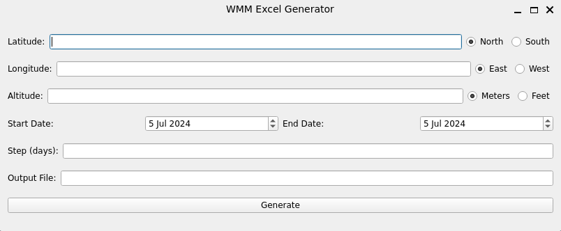
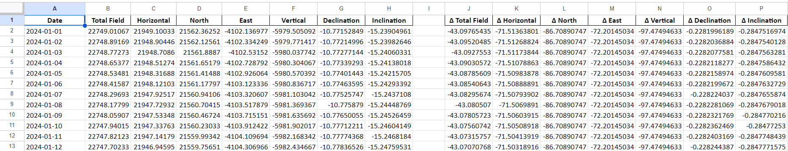

# World Magnetic Model Report Generator

A Python-based tool designed to generate spreadsheet reports based on the World Magnetic Model (WMM).

## Table of Contents

- [Description](#description)
- [Installation](#installation)
- [Usage](#usage)
- [Dependencies](#dependencies)
- [Development](#development)
- [License](#license)

## Description

This project provides a graphical user interface for generating reports using the World Magnetic Model. It allows users to input parameters and generate Excel spreadsheets with magnetic field calculations.

## Installation

1. Clone the repository:

`git clone https://github.com/dougc95/World-Magnetic-Model-Report-Generator.git`

2. Navigate to the project directory:

`cd World-Magnetic-Model-Report-Generator`

3. Install dependencies using Poetry:

`poetry install`

## Usage

To run the application:

`poetry run python main.py`

This will launch the graphical user interface for the WMM Report Generator.

Once launched:
1. Input the required parameters (e.g., date range, coordinates)
2. Click on the 'Generate Report' button
3. Choose the name to save the Excel report

## Dependencies

- Python 3.10 or higher (but lower than 3.13)
- PyQt6 (version 6.5.0)
- pydantic
- numpy
- openpyxl

For a complete list of dependencies, refer to the `pyproject.toml` file.

## Development

This project uses Poetry for dependency management. To set up the development environment:

1. Install development dependencies:

`poetry install --with dev`

2. Run linter:

`poetry run lint`

3. Format code:

`poetry run black .`

## Acknowledgments

This project is based on the World Magnetic Model (WMM) developed by the National Centers for Environmental Information (NCEI). The core calculations are derived from the original C code implementation provided by NCEI, which has been adapted and reimplemented in Python for this project.

For more information about the World Magnetic Model, please visit:
https://www.ncei.noaa.gov/products/world-magnetic-model

We express our gratitude to NCEI for making the WMM code and data publicly available, enabling the development of tools like this one.

## License

This project is licensed under the MIT License. See the [LICENSE](LICENSE) file for details.

